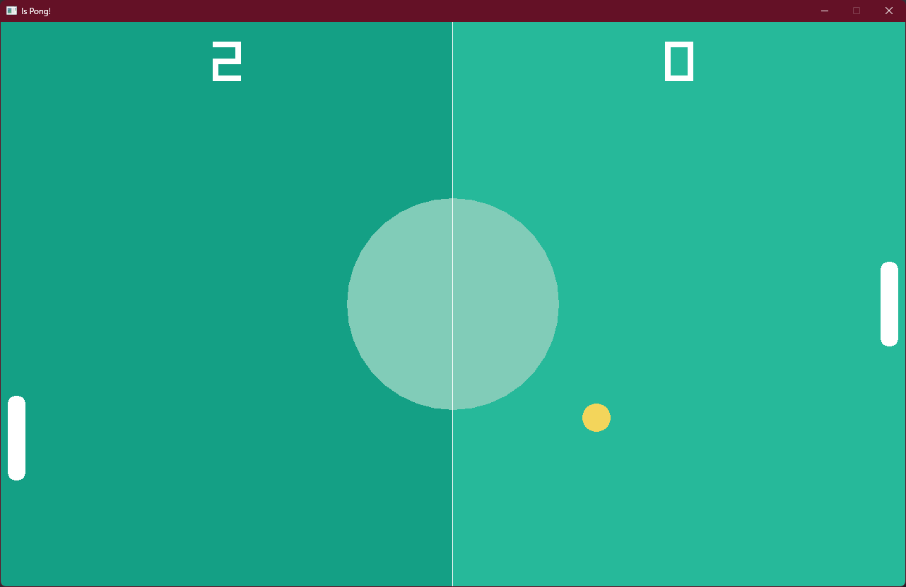

# Is Pong!

This is a little project where used to learn or trying out raylib, but on rust. This is a little pong game which is
made by following the tutorial [🔥Pong Game with C++ and Raylib - Beginner Tutorial](https://youtu.be/VLJlTaFvHo4?si=N6XP3psYxM36hiL_)
by [Programming With Nick](https://www.youtube.com/@programmingwithnick).

The original video is made in C++ but it is fun to write it in rust instead, just to learn rust

